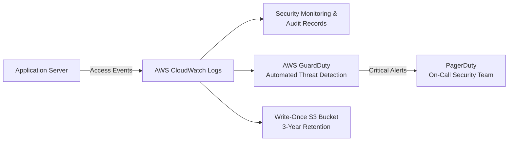

# Audit Logging Flow

This diagram illustrates how access events generated by the Application Server are captured for security monitoring and audit purposes, as described in [Document 1 — System Description](../docs/01-system-description.md) and implemented under control **[AU-2 — Event Logging](../docs/03-system-security-plan.md#au-2--event-logging)**.

---

## What Gets Logged

Per **AU-2** and **AU-6**, every log entry captures:

- Timestamp
- User ID
- IP address
- Action performed
- Data accessed
- Outcome (success / fail)

## Alerting Thresholds (AU-6)

Weekly automated reports flag:

- Failed login attempts exceeding **5 per hour**
- Off-hours access to PHI
- Bulk data downloads exceeding **100 records**
- Access from unexpected geographic locations

Critical alerts trigger PagerDuty notifications to the on-call security team within **15 minutes**.

---

**Related diagrams:**
- [Patient Login & Record Retrieval Flow](data-flow-diagram.md)
- [Prescription Refill Flow](prescription-refill-flow.md)

**Back to:** [README](../README.md) | [Document 3 — System Security Plan](../docs/03-system-security-plan.md)
