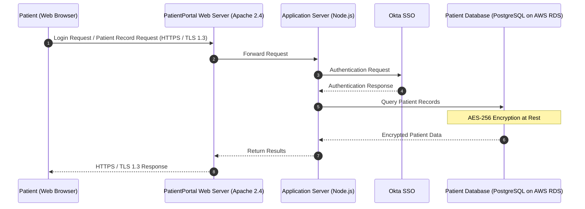
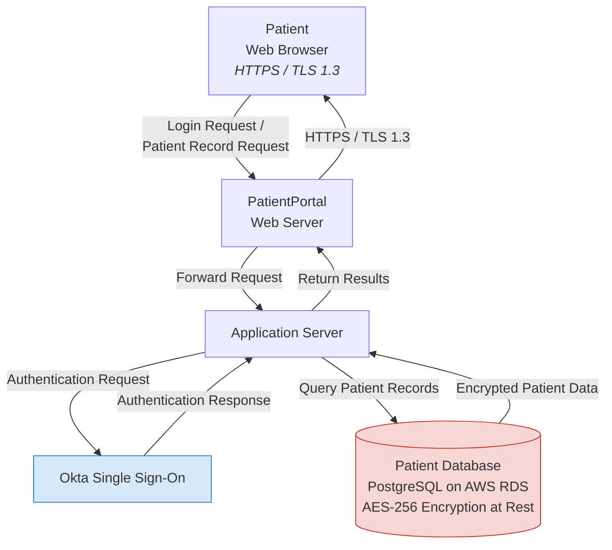

# Data Flow Diagram — Patient Login & Record Retrieval

This diagram illustrates how patient data moves through PatientPortal v1.0 during a standard login and medical record retrieval session, as described in [Document 1 — System Description](../docs/01-system-description.md).

---

## Sequence Diagram

---

## Component Flow Diagram

---

**Related diagrams:**
- [Audit Logging Flow](audit-logging-flow.md)
- [Prescription Refill Flow](prescription-refill-flow.md)

**Back to:** [README](../README.md) | [Document 1 — System Description](../docs/01-system-description.md)
