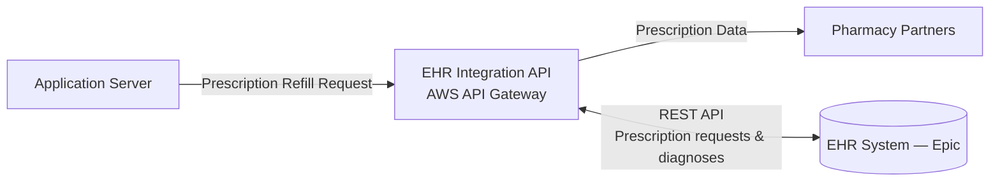

# Prescription Refill Data Flow

This diagram illustrates how prescription refill requests flow from the Application Server to external pharmacy partners via the EHR Integration API, as described in [Document 1 — System Description](../docs/01-system-description.md).

---

## Interconnection Details

| System | Connection Type | Data Shared | Controlled By | Agreement in Place? |
|---|---|---|---|---|
| EHR System (Epic) | REST API | Prescription requests, diagnoses | CareFirst Internal | Yes — API Agreement |
| Pharmacy Partners | via EHR Integration API (A-10) | Prescription data only | Third Party | Covered under EHR API Agreement |

> 📌 The **EHR Integration API (A-10)** is classified as containing PHI (see [Document 1 — Assets Reviewed](../docs/01-system-description.md#assets-reviewed)) and is in scope for all HIGH baseline controls under the [System Security Plan](../docs/03-system-security-plan.md), including [SC-8 — Transmission Confidentiality and Integrity](../docs/03-system-security-plan.md#sc-8--transmission-confidentiality-and-integrity) (mutual TLS for API communications).

---

**Related diagrams:**
- [Patient Login & Record Retrieval Flow](data-flow-diagram.md)
- [Audit Logging Flow](audit-logging-flow.md)

**Back to:** [README](../README.md) | [Document 1 — System Description](../docs/01-system-description.md)
