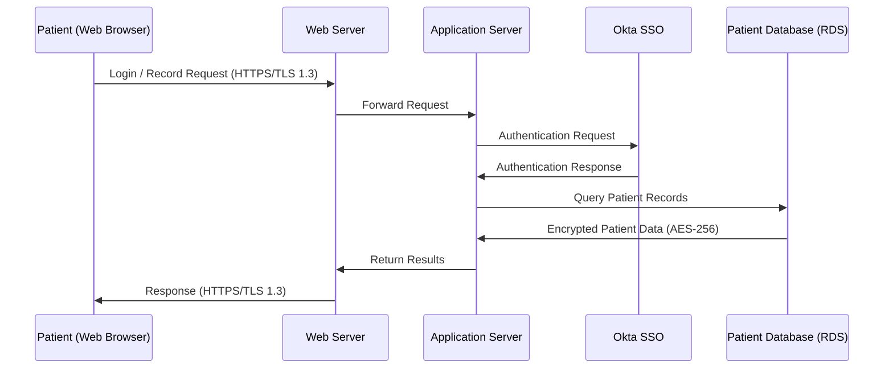

# Document 1 — System Description

> **RMF Step 1**
>
> **Why this matters:** Before any security work can begin, everyone must agree on **what** the system is, **who** uses it, and **what data** it handles. Without a clear system description, security teams may miss critical components.

---

## Executive Summary

PatientPortal v1.0 is a web-based healthcare application operated by **CareFirst Health Systems**, a fictional regional hospital network. The portal allows patients to log in securely, view their medical records, request prescription refills, schedule appointments, and communicate with their care team.

Because it stores and processes **Protected Health Information (PHI)** — including diagnoses, medication history, and Social Security Numbers — the system is subject to **HIPAA**, **FISMA**, and the **NIST Risk Management Framework**.

---

## Scope

This system description covers all components of PatientPortal v1.0 within the **Authorization Boundary**, including:

- Web servers
- Application servers
- Database servers
- Network infrastructure
- Third-party integrations

---

## Assets Reviewed

| Asset ID | Component | Type | Location | Contains PHI? |
|---|---|---|---|---|
| A-01 | Web Server (Apache 2.4) | Server | AWS us-east-1 (Cloud) | No |
| A-02 | Application Server (Node.js) | Server | AWS us-east-1 (Cloud) | Yes |
| A-03 | Patient Database (PostgreSQL) | Database | AWS RDS | Yes |
| A-04 | Authentication Service (Okta) | Third-Party SaaS | Cloud (Okta) | Yes (user IDs) |
| A-05 | Audit Logging Service | Server | AWS CloudWatch | Yes (metadata) |
| A-06 | Admin Workstations (x4) | Endpoint | CareFirst HQ Office | No |
| A-07 | Internal Network (VLAN) | Network | CareFirst HQ | No |
| A-08 | Backup Storage (Encrypted S3) | Storage | AWS S3 | Yes |
| A-09 | Staff Email (Microsoft 365) | Third-Party SaaS | Cloud (Microsoft) | Limited |
| A-10 | EHR Integration API | Interface | AWS API Gateway | Yes |

---

## System Architecture & Data Flow

The following describes how patient data moves through the system:

1. Patient accesses PatientPortal via a web browser using **HTTPS (TLS 1.3)**.
2. The web server receives the request and forwards it to the **Application Server**.
3. The application server authenticates the user via the **Okta Single Sign-On (SSO)** service.
4. Upon successful authentication, the application queries the **Patient Database** (PostgreSQL on AWS RDS) to retrieve the patient's health records.
5. Records are encrypted **at rest (AES-256)** and **in transit (TLS 1.3)**.
6. All access events are logged in **AWS CloudWatch** for monitoring and audit purposes.
7. For prescription refills, the system communicates outbound to the **EHR Integration API**, which connects to pharmacy partners.

### Data Flow Diagrams

Full interactive Mermaid versions of each flow below are available in [`/diagrams`](../diagrams):

- [Login & Patient Record Retrieval Flow](../diagrams/data-flow-diagram.md)
- [Audit Logging Flow](../diagrams/audit-logging-flow.md)
- [Prescription Refill Flow](../diagrams/prescription-refill-flow.md)

**Quick view — Login & Record Retrieval:**

---

## Users & Roles

| User Role | Count (Est.) | Access Level | PHI Access |
|---|---|---|---|
| Patient (End User) | ~15,000 | Self-service portal only | Own records only |
| Clinical Staff (Nurses/Doctors) | ~200 | Patient record view/edit | All assigned patients |
| System Administrator | 4 | Full system access | Yes — admin logs |
| Security Analyst | 2 | Read-only audit/log access | Metadata only |
| Help Desk Staff | 8 | Limited support access | Name, DOB, contact info |
| Third-Party API (EHR) | 1 service account | API-only (outbound) | Prescription data only |

---

## Interconnections & Dependencies

| System | Connection Type | Data Shared | Controlled By | Agreement in Place? |
|---|---|---|---|---|
| Okta (SSO Provider) | HTTPS/SAML 2.0 | User identities, session tokens | Third Party | Yes — BAA + MOU |
| AWS Cloud Infrastructure | Managed Hosting | All system data | Third Party (AWS) | Yes — AWS BAA |
| EHR System (Epic) | REST API | Prescription requests, diagnoses | CareFirst Internal | Yes — API Agreement |
| Microsoft 365 | SMTP / Email | Non-PHI staff communications | Third Party (Microsoft) | Yes — BAA |
| State Health Department | Encrypted File Transfer | Required disease reporting | Government | Yes — Data Sharing Agreement |

---

**Next:** [Document 2 — FIPS 199 Categorization Memo →](02-fips-199-categorization.md)
