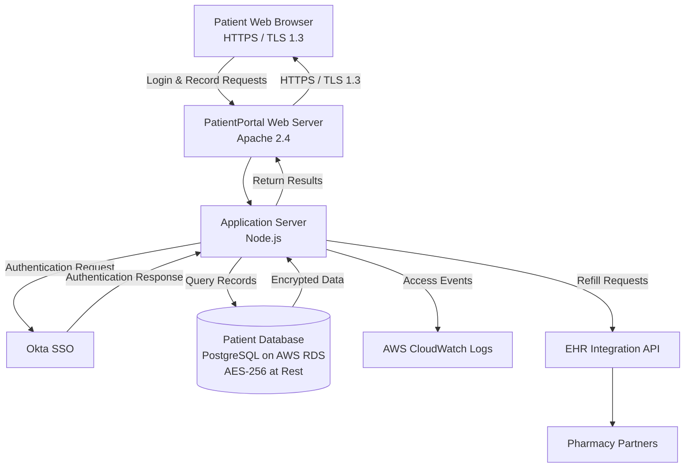

# 🏥 PatientPortal v1.0 — NIST RMF Authorization Package

[](#)
[](#)
[](#)
[](#)
[](#)
[](#)

> A complete, step-by-step **NIST Risk Management Framework (RMF)** authorization package built for **PatientPortal v1.0**, a fictional healthcare web application operated by **CareFirst Health Systems**. This repository was developed as a **GRC / cybersecurity portfolio project** to demonstrate end-to-end RMF documentation skills — from system categorization through Authorization to Operate (ATO) recommendation.

---

## ⚠️ Disclaimer

**This is a fictional, educational portfolio project.** CareFirst Health Systems, PatientPortal v1.0, all personnel named (e.g., Michael Adeyemi, Amaka Okafor, Dr. Chioma Ezeh), asset identifiers, vulnerability findings, and timelines are **entirely fictitious**. No real systems, organizations, or individuals are represented. This package exists solely to demonstrate familiarity with NIST RMF documentation deliverables for job applications and professional development.

---

## 📖 What Is This?

This repository documents the full RMF lifecycle for a **HIGH-impact healthcare web application** that stores Protected Health Information (PHI). It walks through every stage of the RMF process — categorize, select, implement, assess, authorize — using realistic, plain-English documentation that mirrors what a GRC Analyst or ISSO would produce in a real federal or healthcare environment.

### What Is the NIST RMF?

The **NIST Risk Management Framework (RMF)** is a structured, repeatable process used by U.S. federal agencies and HIPAA-covered healthcare organizations to identify, assess, and manage cybersecurity risk before a system is authorized to operate. Think of it as a formal checklist proving a system is "safe enough" to handle sensitive data — every federal information system must complete this process to receive an **Authority to Operate (ATO)**.

---

## 🗂️ Repository Structure

```
patientportal-rmf-package/
├── README.md                          ← You are here
├── LICENSE
├── Documents/
│   ├── 01-System-Description.md       ← What is the system? Who uses it?
│   ├── 02-FIPS-199-Categorization.md  ← How serious would a breach be?
│   ├── 03-System-Security-Plan.md     ← What controls are in place?
│   ├── 04-Risk-Assessment.md          ← What could go wrong?
│   ├── 05-POAM.md                     ← What gaps exist, and how/when will we fix them?
│   └── 06-Security-Assessment-Report.md ← Did we test the controls? Did they work?
└── Diagrams/
    ├── Data-Flow-Diagram.md           ← Patient login & record retrieval (Mermaid)
    ├── Audit-Logging-Flow.md          ← Audit/event logging flow (Mermaid)
    └── Prescription-Refill-Flow.md    ← EHR/pharmacy integration flow (Mermaid)
```

---

## 📋 System Snapshot

| Field | Details |
|---|---|
| **System Name** | PatientPortal v1.0 |
| **Organization** | CareFirst Health Systems *(Fictional)* |
| **System Type** | Healthcare Web Application |
| **Data Classification** | Protected Health Information (PHI) |
| **Security Categorization** | **HIGH** (FIPS 199) |
| **Control Baseline** | NIST SP 800-53 Rev 5 — High Baseline |
| **Applicable Regulations** | HIPAA Security Rule / FISMA |
| **Package Prepared By** | John C. Ilogbene |
| **Date Prepared** | June 2026 |
| **Package Version** | 1.0 |
| **Final ATO Recommendation** | **Conditional Authority to Operate** |

---

## 🧭 Navigating the RMF Steps

The RMF process consists of six interlinked steps. Each document in this repo maps to one step:

| Step | Document | Plain-English Purpose |
|---|---|---|
| 1 | [System Description](Documents/01-System-Description.md) | What is this system and who uses it? |
| 2 | [FIPS 199 Categorization Memo](Documents/02-FIPS-199-Categorization.md) | How serious would a breach be? |
| 3 | [System Security Plan (SSP)](Documents/03-System-Security-Plan.md) | What security controls are in place and how do they work? |
| 4 | [Risk Assessment (SP 800-30)](Documents/04-Risk-Assessment.md) | What could go wrong, and how bad would it be? |
| 5 | [Plan of Action & Milestones (POA&M)](Documents/05-POAM.md) | What security gaps exist, and how will we fix them? |
| 6 | [Security Assessment Report (SAR)](Documents/06-Security-Assessment-Report.md) | Did we actually test the controls? What did we find? |

---

## 🎯 Headline Findings

| Area | Result |
|---|---|
| **FIPS 199 Categorization** | Confidentiality: **HIGH**, Integrity: **HIGH**, Availability: **MODERATE** → Overall: **HIGH** |
| **Controls Documented (SSP)** | 12 controls across 7 control families |
| **Risk Assessment** | 5 threat scenarios identified — **2 HIGH**, **2 MODERATE residual**, all tracked |
| **POA&M Open Items** | 3 findings (SI-2, CM-6, AC-6/AC-17) |
| **SAR Result** | 4 of 6 tested controls **PASS**, 1 **PARTIAL**, 1 **FAIL** |
| **ATO Recommendation** | **Conditional ATO** — pending closure of RDP exposure, service account MFA, and patch backlog |

---

## 🛠️ Skills Demonstrated

| Skill Demonstrated | Where Shown | Industry Relevance |
|---|---|---|
| FIPS 199 system categorization | [Doc 2](Documents/02-FIPS-199-Categorization.md) | Required for all federal systems before control selection |
| NIST SP 800-53 control selection & implementation | [Doc 3 — SSP](Documents/03-System-Security-Plan.md) | Core GRC analyst skill — daily responsibility |
| Risk assessment methodology (SP 800-30) | [Doc 4](Documents/04-Risk-Assessment.md) | Required for FedRAMP, FISMA, and HIPAA compliance programs |
| POA&M development and management | [Doc 5](Documents/05-POAM.md) | GRC analysts update POA&Ms monthly — critical job skill |
| Security assessment & findings reporting | [Doc 6 — SAR](Documents/06-Security-Assessment-Report.md) | Required for ATO packages and compliance audits |
| Healthcare / HIPAA security knowledge | All documents | High-demand sector with an acute talent shortage |
| Explaining security concepts in plain language | All documents | Required for presenting to non-technical executives |
| Documentation quality & professionalism | All documents | Distinguishes senior from entry-level analysts |

---

## 🔄 System Architecture at a Glance



See the [`Diagrams/`](Diagrams) folder for the full set of detailed Mermaid data-flow diagrams.


---

## 👤 Author

**John C. Ilogbene**
GRC & Cybersecurity Portfolio — June 2026
